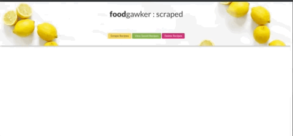

# AllRecipes Scraper

This app scrapes information from the website Allrecipes and renders it in handlebars. From there the user can either go to the website and see the recipe and/or save it. When the recipe is saved the user can go to the saved page and add a note or delete it.

The user can also delete all the scraped items and scrape again for new and fresh recipes. 

This app was built using Express as a server, MongoDB as the Database along with Mongoose as the ODM and Handlebars as the template. 
The dependencies used to scrape were axios and cheerio. 
The app was deployed to Heorku and Mongo Atlas was used to allow the database functionality to work in Heroku. 

# Sample Images

Below are some gifs to exemplify the functionality of this app.

## Scrape recipes

When the user hits the scrape button it will hit the scrape route that uses axios to fetch the information and cheerio to parse through it and deliver the content.



## Delete Recipes

The user can also delete all the recipes by hitting the button delete which will delete all the recipes stored in the database all at once. 


## Save Recipe

When the user hits the button save on the card of the recipe this will send that recipe to another page that they can access it by clicking the button saved Recipes


## Add and Delete Note

When in the saved Recipes page the user can click the button notes and add a note. When they close out the modal and open it again the written note will populate the bottom of the modal with a trash can by it side. it the user wants to delete the note, they only need to click the trash can. The two gifs below demonstrate this functionality.

**Save Note**


**Delete Note**


## Delete Saved Recipe

 The user can also delete a Recipe from their saved Recipe page.


## Installations

Here are the installs made to complete this application

The server set up in this app is Express. In order work with it through in the command line, it is necessary to install it. 

````
npm install express
````
As mentioned above, handlebars is the template uded to render this app. In order to be able to work with Handlebars, it is necessary to install it through npm as well. 

````
npm install express-handlebars
````
MongoDB runs globally in my machine so no installs were necessary. However, Mongoose was used to create schemas and a relation between saved recipes and notes

````
npm install mongoose
````
As mentioned above axios was used to scrape the content of the AllRecipes website. Cheerio was used to parse it.

````
npm install axios
````
````
npm install cheerio
````


## Built With

* [HTML](https://developer.mozilla.org/en-US/docs/Web/HTML)

* [CSS](https://developer.mozilla.org/en-US/docs/Web/CSS)

* [Javascript](https://developer.mozilla.org/en-US/docs/Web/JavaScript)

* [jQuery](https://developer.mozilla.org/en-US/docs/Glossary/jQuery)

* [Node.js / Express](https://developer.mozilla.org/en-US/docs/Learn/Server-side/Express_Nodejs)

* [Bootstrap](https://getbootstrap.com/docs/4.4/getting-started/introduction/)

* [Handlebars](https://handlebarsjs.com/guide/#what-is-handlebars)

* [Mongoose](https://mongoosejs.com/)

* [Mongo](https://www.mongodb.com/)

* [Axios](https://www.npmjs.com/package/axios)

* [Cheerio](https://www.npmjs.com/package/cheerio)

## Deployed Link
* [See Live Site](https://dashboard.heroku.com/apps/damp-eyrie-19615)

## Author

- [Sara Neves Pereira](https://github.com/SaraNP-33)

## License
This project is licensed under the ISC License.